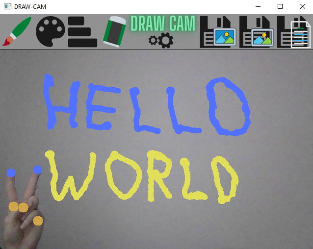

# DRAW CAM - Ai virtual painter
**Application which lets you draw and write with your hands movement**
 - [x] Uses Mediapipe algorithms for hands recognition
 - [x] Requires web cam to work
 - [x] Allows for painting on top of your camera output with multiple tools
 - [X] Work with one or two hands
 - [ ] WIP: Has image to text feature. Converts letters which You draw to .txt
 - [x] Friendly and simple interface
 
# Usage:
**Make sure your webcam is connected and is working properly**
> App window is scalable with cam resolution, low res cameras might work poorly with this program
- Use raised index finger to draw with selected tool
- To stop drawing, rise any other finger or lower your index finger
- Rise your middle and index finger and join them together to enter select mode 
- In select mode you can choose one from menu options, separate or lower fingers to exit selection mode
- To save your work, use selection mode and select one of the following: 
> - Save as image with camera output as a background
> - Save as transparent image without background (only your drawing)
> - Save as text - any recognized letters on your canvas will be saved to .txt file

### Example

## Installation
Install dependencies listed below. Copy this repo into one designated folder and run DrawCam.py

## Resources and Dependencies:
Dependencies:
> - OpenCV - https://opencv.org 
> - MediaPipe https://mediapipe.dev
> - NumPy https://numpy.org 

## License 
This project is licensed under the terms of the MIT license.    